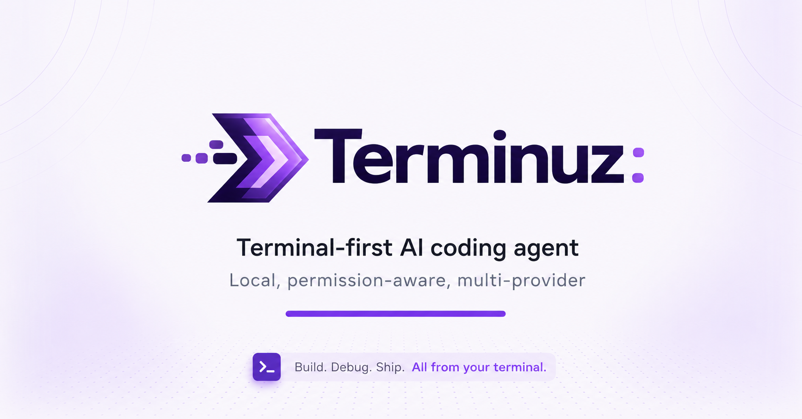

# Terminuz

> **Terminuz - The Open Source AI Coding Agent**

Terminuz is a local, permission-aware, multi-provider coding agent for the
terminal. It understands repositories, executes tools, works with multiple LLM
providers, and keeps control of filesystem and shell operations with the user.

The project was previously published as **DeepCode**. Existing `.deepcode/`
configuration, `DEEPCODE_*` variables, sessions, and custom agents remain
supported during the migration window. The `deepcode-ai` compatibility package
is supported through 2027-01-08.

<p align="center">
  
</p>

<p align="center">
  <a href="https://github.com/N1ghthill/terminuz/actions/workflows/ci.yml"></a>
  <a href="https://www.npmjs.com/package/terminuz"></a>
  <a href="https://www.npmjs.com/package/terminuz"></a>
  
  <a href="LICENSE"></a>
</p>

## Built with OpenAI Codex

Terminuz was built primarily with OpenAI Codex. Local evidence preserves 51
product-development sessions starting with the repository's creation on May 7, 2026. The first Codex session initialized the repository and produced its first
seven commits. The current history remains intact: 406 of 425 commits (95.5%)
use the `DeepCode` author identity configured by Codex before the project was
renamed to Terminuz.

For the OpenAI Build Week, GPT-5.6 was used to add health-aware provider
routing. Failover now skips unusable targets, applies cooldowns after transient
failures, honors longer `Retry-After` values, recovers automatically, and emits
sanitized `provider.route` events. See the
[Build Week evidence and demo kit](docs/22-openai-build-week-submission.md).

## Features

- Interactive Ink TUI with streaming, approvals, diff previews, themes, and Vim keybindings
- Non-interactive `terminuz run` mode for scripts and CI
- Anthropic, OpenAI, DeepSeek, Groq, Ollama, OpenRouter, OpenCode, and MCP
- Filesystem, shell, git, ripgrep, test, lint, and LSP tools
- GitHub authentication, issues, pull requests, review, and merge workflows
- Foreground and background subagents
- Context compaction, token budgets, provider failover, and per-mode routing
- Path policies, approval gateway, audit logs, and secret redaction

## Installation

Terminuz requires Node.js 22 or newer.

```bash
npm install -g terminuz
terminuz --version
```

Using pnpm:

```bash
pnpm add -g terminuz
```

Stable channel:

```bash
npm install -g --tag stable terminuz
pnpm add -g terminuz@stable
```

## Quick Start

```bash
terminuz init
terminuz
```

Inside the TUI:

```text
/setup      configure provider, API key, and model
/provider   choose a provider
/model      choose a model
/doctor     validate the local environment
```

Scriptable setup:

```bash
terminuz config set defaultProvider deepseek
terminuz config set defaultModels.deepseek "deepseek-chat"
terminuz config set providers.deepseek.apiKey "<your-key>"
terminuz doctor
```

Environment variables:

```bash
export TERMINUZ_PROVIDER=anthropic
export TERMINUZ_MODEL=claude-sonnet-4-5
export ANTHROPIC_API_KEY="<your-key>"
terminuz
```

## Commands

```bash
terminuz
terminuz chat
terminuz run "fix the failing tests" --yes
terminuz run "refactor the auth module" --mode plan
terminuz review
terminuz doctor
terminuz update
terminuz cache tmp clear

terminuz github login
terminuz github prs
terminuz github review 42

terminuz subagents run \
  --task "audit the auth module" \
  --task "audit the billing module" \
  --concurrency 2 --yes
```

## Configuration

Terminuz writes project configuration and runtime data under `.terminuz/`.
Provider API keys and GitHub tokens are not stored there. Secrets entered with
the TUI or `terminuz config set` are kept in a private, project-scoped entry in
the operating system's user configuration directory. Print its location with:

```bash
terminuz config credentials-path
```

On Linux the default is `~/.config/terminuz/credentials.json`. The directory is
created with mode `0700` and the file with mode `0600`. Existing plaintext
credentials in `.terminuz/config.json` or `.deepcode/config.json` are migrated
on first load, removed from the project file, and related transient caches are
cleared. Exact copies in existing sessions, telemetry, and logs are redacted. A non-secret `.terminuz/credential-scope` identifier keeps the secure
entry associated when a project directory is moved. Environment variables remain runtime-only, and `apiKeyFile` can point
to a protected file outside the project. Secret-bearing environment variables
are removed from shell, Git, LSP, and other child-process environments.

```json
{
  "defaultProvider": "anthropic",
  "defaultModels": {
    "anthropic": "claude-sonnet-4-5"
  },
  "permissions": {
    "read": "allow",
    "write": "ask",
    "shell": "ask",
    "mcp": "ask"
  },
  "mcpServers": []
}
```

Resolution order:

1. explicit CLI config path;
2. `TERMINUZ_*` environment variables;
3. legacy `DEEPCODE_*` variables;
4. `.terminuz/config.json`;
5. legacy `.deepcode/config.json`;
6. defaults.

Terminuz writes new state to `.terminuz/` and does not delete `.deepcode/`.
The only automatic legacy-file change is removal of plaintext credentials after
they have been copied successfully to the protected user credential store.
See the [configuration reference](docs/16-configuration.md) and
[rebranding roadmap](docs/18-terminuz-rebranding-roadmap.md).

## Migrating from DeepCode

```bash
npm uninstall -g deepcode-ai
npm install -g terminuz
terminuz
```

During the transition:

- `deepcode-ai` remains a compatibility package;
- `deepcode` and `deepcode-ai` invoke Terminuz and display a migration notice;
- `.deepcode/config.json` is used when `.terminuz/config.json` is absent;
- `DEEPCODE_*` variables remain lower-priority aliases;
- legacy user and project sessions are read without deleting or moving them.

The `deepcode-ai` wrapper remains supported through 2027-01-08. Do not delete
`.deepcode/` until your migrated project and sessions have been verified.

## Development

```bash
git clone https://github.com/N1ghthill/terminuz.git
cd terminuz
corepack pnpm install
corepack pnpm build
corepack pnpm dev
```

Validation:

```bash
corepack pnpm validate
```

Repository layout:

- `apps/terminuz` - publishable Terminuz package and entrypoint
- `apps/deepcode-legacy` - temporary `deepcode-ai` compatibility package
- `packages/cli` - commands and Ink TUI
- `packages/core` - agent runtime, providers, tools, security, and integrations
- `packages/shared` - schemas, identity constants, and shared contracts
- `docs` - product and engineering reference

## Documentation

- [Documentation index](docs/README.md)
- [Architecture](docs/02-architecture-overview.md)
- [Security model](docs/06-security-model.md)
- [Tool system](docs/08-tool-system.md)
- [Configuration](docs/16-configuration.md)
- [Terminuz rebranding roadmap](docs/18-terminuz-rebranding-roadmap.md)
- [Production readiness evidence](docs/21-production-readiness-evidence.md)

## Acknowledgments

The Ink-based terminal UI is adapted from
[Qwen Code](https://github.com/QwenLM/qwen-code) under Apache 2.0. The agent
architecture also draws inspiration from `google-gemini/gemini-cli`.

Terminuz adds its own multi-provider runtime, permission-aware tool execution,
local intent handling, MCP and GitHub integrations, provider orchestration,
token budgets, project discovery, and subagent workflows.

## License

Terminuz is released under the [MIT License](LICENSE). Adapted components remain
subject to their respective licenses.
