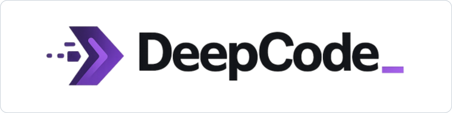

# DeepCode

<p align="center">
  
</p>

> Terminal-first AI coding agent — local, permission-aware, and multi-provider.

<p align="center">
  <a href="https://github.com/N1ghthill/deepcode/actions/workflows/ci.yml"></a>
  <a href="https://www.npmjs.com/package/deepcode-ai"></a>
  <a href="https://www.npmjs.com/package/deepcode-ai"></a>
  
  <a href="LICENSE"></a>
</p>


DeepCode is an AI coding agent that runs in your terminal. It understands your codebase, executes tools safely, and works with multiple LLM providers (Anthropic, OpenAI, DeepSeek, Groq, Ollama, OpenRouter, MCP).

Unlike cloud-first agents, DeepCode operates locally with a **permission model** you control — read, write, shell, and dangerous operations each have configurable approval policies.

---

## What DeepCode Actually Does

**Example: listing your projects**

```bash
$ deepcode
> list my projects

Scanning for git repositories in ~/...
Found 3 projects:
  - ~/repos/my-api
  - ~/repos/frontend
  - ~/work/cli-tool
```

**Key behaviors:**

| User asks | DeepCode does | Cost |
|-----------|---------------|------|
| `"list my projects"` | Scans locally for `.git` directories | **0 tokens** (local) |
| `"hello"` / `"hi"` | Returns greeting instantly | **0 tokens** |
| `"what's the weather?"` | Responds as a coding agent instead of inventing an answer | **0 tokens** |
| `"refactor auth module"` | Calls LLM, creates plan, asks approval | tokens used |

DeepCode only calls the LLM when **actually needed** — not for chit-chat, not for trivial discovery.

---

## Features

- **Interactive TUI** — Ink-based terminal UI with real-time streaming, diff previews, approval flows, and Vim keybindings
- **Non-interactive mode** — `deepcode run` for scripting and CI pipelines
- **Multi-provider LLM** — Anthropic, OpenAI, DeepSeek, Groq, Ollama, OpenRouter, OpenCode — with automatic failover and per-mode routing
- **Tool system** — filesystem read/write, shell, ripgrep search, git, lint, test runners, LSP symbols
- **MCP support** — connect any Model Context Protocol server; tools appear automatically in the agent
- **GitHub integration** — authenticate, browse issues, manage pull requests, and run AI code review on any PR
- **Context window management** — auto-summarizes conversation history when approaching the model's context limit
- **Token budget** — configurable input/output/cost limits with warnings and hard stops
- **Safety model** — path allowlist/blacklist, per-operation permission levels, approval gateway, audit logging, secret redaction
- **Intent classification & local responses** — answers greetings, trivial questions, and project discovery without calling an LLM

---

## Supported Providers

| Provider | ID | Notes |
|----------|----|-------|
| Anthropic | `anthropic` | Claude 3.x / 4.x family |
| OpenAI | `openai` | GPT-4o, o3, o4-mini |
| DeepSeek | `deepseek` | deepseek-chat, deepseek-reasoner |
| Groq | `groq` | Fast inference, Llama / Mixtral |
| Ollama | `ollama` | Local models, no API key required |
| OpenRouter | `openrouter` | Unified access to 200+ models |
| OpenCode | `opencode` | `opencode-go/` model prefix |

---

## Installation

Requires Node.js 22 or newer.

```bash
npm install -g deepcode-ai
```

Or with pnpm:

```bash
pnpm add -g deepcode-ai
```

Check published channels and upgrade hints:

```bash
deepcode update
```

---

## Quick Start

Fastest interactive setup:

```bash
deepcode init
deepcode
```

Inside the TUI, use:

```text
/setup      guided provider, key, model, and doctor flow
/provider   choose a provider and save an API key
/model      pick the model for that provider
/doctor     validate the local environment and runtime configuration
```

Scriptable setup:

```bash
deepcode init
deepcode config set defaultProvider deepseek
deepcode config set defaultModels.deepseek "deepseek-chat"
deepcode config set providers.deepseek.apiKey "<your-key>"
deepcode doctor
deepcode
```

Or via environment variables:

```bash
export DEEPCODE_PROVIDER=anthropic
export DEEPCODE_MODEL=claude-sonnet-4-5
export ANTHROPIC_API_KEY="<your-key>"

deepcode
```

---

## Core Commands

```bash
# Interactive TUI
deepcode
deepcode chat

# Non-interactive task execution
deepcode run "fix the failing tests" --yes
deepcode run "inspect a trusted external path" --yes --allow-outside-worktree
deepcode run "use a trusted external tool" --yes --allow-dangerous
deepcode run "refactor the auth module" --mode plan

# Configuration
deepcode config show --effective
deepcode config set defaultProvider openai
deepcode doctor
deepcode update
deepcode cache tmp clear

# GitHub
deepcode github login
deepcode github prs
deepcode github review 42
deepcode github merge 42

# Parallel subagents
deepcode subagents run \
  --task "audit the auth module" \
  --task "audit the billing module" \
  --concurrency 2 --yes
```

---

## MCP Servers

Add any MCP-compatible server to `~/.deepcode/config.json`:

```json
{
  "mcpServers": [
    { "name": "filesystem", "command": "npx", "args": ["-y", "@modelcontextprotocol/server-filesystem", "/tmp"] },
    { "name": "github", "command": "npx", "args": ["-y", "@modelcontextprotocol/server-github"] }
  ]
}
```

Tools from connected servers appear automatically in the agent prefixed as `server__tool`.
MCP tool calls require approval by default. You can allow a trusted tool explicitly:

```bash
deepcode config set mcpPermissions.github__list_issues allow
```

In non-interactive mode, `--yes` approves normal requests inside the configured path whitelist. Paths outside the whitelist require `--yes --allow-outside-worktree`. External MCP tools and dangerous operations require `--yes --allow-dangerous` unless they are allowed by config.

---

## Safety Model

DeepCode acts on a real local repository, so safety is a first-class runtime concern:

- Path allowlist and blacklist enforcement
- Permission levels: `read`, `write`, `gitLocal`, `shell`, `dangerous`
- Approval gateway for sensitive operations with diff previews
- Audit logging of all tool calls
- Redaction of known secrets in logs and agent output

Useful non-interactive approval combinations:

```bash
deepcode run "fix local tests" --yes
deepcode run "read /tmp/fixture-output" --yes --allow-outside-worktree
deepcode run "call a trusted MCP write tool" --yes --allow-dangerous
```

Full details: [docs/06-security-model.md](docs/06-security-model.md)

---

## Configuration

DeepCode stores config in `~/.deepcode/config.json`. Key fields:

```json
{
  "defaultProvider": "anthropic",
  "defaultModels": { "anthropic": "claude-sonnet-4-5" },
  "modeDefaults": {
    "plan": { "provider": "anthropic", "model": "claude-opus-4-5" },
    "build": { "provider": "anthropic", "model": "claude-sonnet-4-5" }
  },
  "providerRetries": 2,
  "contextWindowThreshold": 0.8,
  "tokenBudget": { "maxCostUsd": 1.0, "warnAtFraction": 0.8 },
  "permissions": { "read": "allow", "write": "ask", "shell": "ask", "mcp": "ask" },
  "mcpPermissions": { "github__list_issues": "allow" },
  "mcpServers": []
}
```

Full reference: [docs/16-configuration.md](docs/16-configuration.md)

---

## Development

```bash
git clone https://github.com/N1ghthill/deepcode.git
cd deepcode
pnpm install
pnpm build
pnpm dev
```

Validation:

```bash
pnpm lint
pnpm typecheck
pnpm test
```

**Repository layout:**

- `apps/deepcode` — publishable CLI package and entrypoint
- `packages/cli` — commands and Ink TUI
- `packages/core` — agent runtime, providers, tools, GitHub, cache
- `packages/shared` — schemas, types, config contracts
- `docs` — product and engineering reference

---

## Documentation

- [Architecture Overview](docs/02-architecture-overview.md)
- [Configuration Reference](docs/16-configuration.md)
- [Tool System](docs/08-tool-system.md)
- [Security Model](docs/06-security-model.md)
- [Agent Loop](docs/09-agent-loop.md)
- [GitHub Integration](docs/10-github-integration.md)
- [Full docs index](docs/README.md)

---

## Contributing

See [CONTRIBUTING.md](CONTRIBUTING.md). Run `pnpm lint && pnpm typecheck && pnpm test` before opening a PR.

---

## License

[MIT](LICENSE)

---

## Acknowledgments

DeepCode is built on the shoulders of open-source projects. This repository would not exist in its current form without that foundation.

### TUI Foundation

The Ink-based terminal UI is adapted from [Qwen Code](https://github.com/QwenLM/qwen-code) (Apache 2.0).

### Core Agent Loop

The agent architecture draws inspiration from `google-gemini/gemini-cli`.

### Key Differentiators

While the TUI foundation comes from Qwen Code, DeepCode adds substantial original engineering:

- **Multi-provider LLM runtime** — Anthropic, OpenAI, DeepSeek, Groq, Ollama, OpenRouter, OpenCode, MCP — with automatic failover and per-mode routing
- **Permission-aware tool execution** — granular security model with `read` / `write` / `shell` / `dangerous` levels, path allowlist/blacklist, approval gateway, and audit logging
- **Intent classification & local responses** — answers greetings and trivial requests without calling an LLM
- **Non-streaming fallback** — handles providers that do not emit incremental deltas cleanly
- **MCP server integration** — Model Context Protocol servers plug in directly and expose tools automatically
- **GitHub integration** — authenticate, browse PRs, run AI code reviews, and merge from the terminal
- **Provider/model orchestration** — no hardcoded defaults; explicit validation and clean state initialization
- **Token budget & context management** — configurable cost limits with warnings and hard stops
- **Project discovery via git** — "list my projects" scans for `.git` directories locally without calling an LLM

### License Compliance

DeepCode is released under the **MIT License**.
Adapted code from Qwen Code (Apache 2.0) and other open-source projects is used in compliance with their respective licenses.
